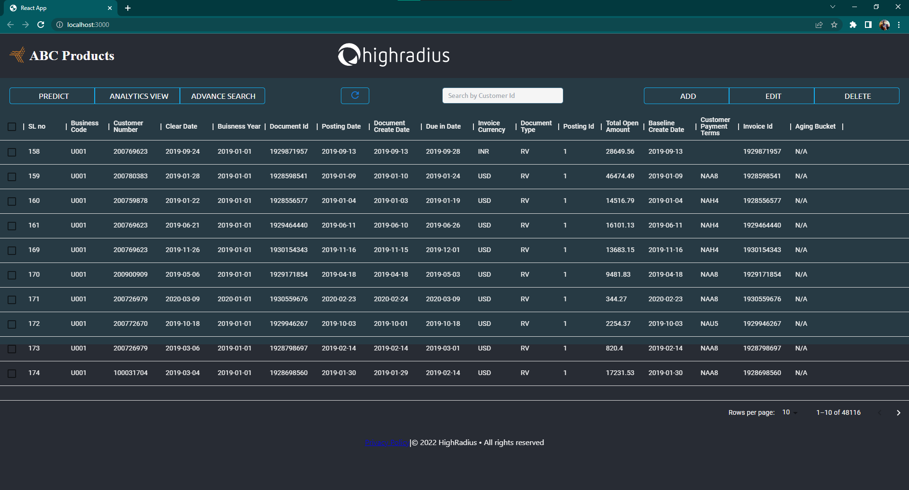

# 🌐 AI-Enabled FinTech B2B Invoice Management Application 

---

## 🗒️ Introduction to B2B Operations
Business-to-business (B2B), also called B-to-B, is a form of transaction between businesses, such as one involving a manufacturer and wholesaler, or a wholesaler and a retailer. Business-to-business refers to business that is conducted between companies, rather than between a company and individual consumer. 

---
## ❓ Problem Statement

- Build a Machine Learning Model to predict the payment date of an invoice when it gets created in the system.
- Build a full stack Invoice Management Application

---

## ✨ Features

- Machine Learning Model to predict the payment date of an invoice when it gets created in the system.
- CRUD (Create, Read, Update, Delete) Operations.
- A Dashboard to visualize data.

---

## :bulb: Technologies Used

### Machine Learning

- **Numpy**
- **Pandas**
- **Matplotlib**
- **Scikit-learn**

### Frontend

- **HTML**
- **CSS**
- **JavaScript**
- **React JS**

### Backend

- **Java**
- **Servlets**
- **JDBC**
- **MySQL**

### Tools

- **Eclipse IDE**
- **Visual Studio Code**
- **Postman API Testing Tools**
- **SQL Yog**
- **Jupyter Notebook/Google colab**

---

## :camera: Screenshot

---

**Maintained By: ⭐ [Suman Meher](github.com/sumanmeher)** 

